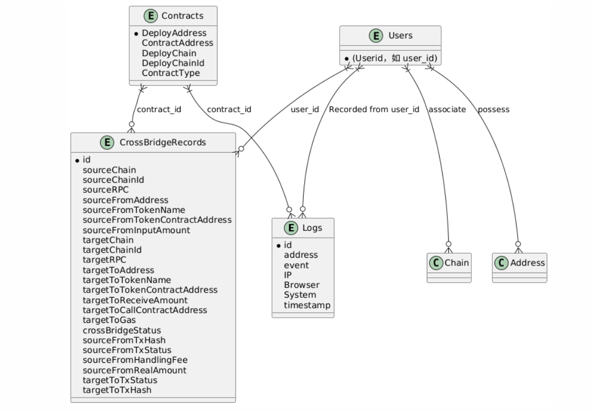

#### Users Table

|column name|comment|
|:-:|:-:|
|Address|Primary Key|
|Chain|[Ethereum, Imua, Zetachain]|

#### Contracts Table
|column name|comment|
|:-:|:-:|
|ContractAddress|Primary Key|
|DeployChain|Deployment chain|
|DeployChainId|Deployment ID|
|ContractType|Contract Type (0:Lock coin contract;1:Coinage contract)|
|DeployAddress|Deployer|

### CrossBridgeRecords
|column name|comment|
|:-:|:-:|
|id|Primary Key|
|sourceChain|Source Chain|
|sourceChainId|Source ChainId|
|sourceRPC|Source ChainRPC|
|sourceFromAddress|The address where the source chain initiates the transaction|
|sourceFromTokenName|The name of the Token that the source chain is preparing to cross chains|
|sourceFromTokenContractAddress|The Token contract address of the source chain for cross-chain preparation (if it is a native token, it is empty)|
|sourceFromInputAmount|The number of cross-chain inputs in the source chain|
|sourceFromHandingFee|Source Chain receivable handling fee (0.8%)|
|sourceFromRealAmount|The actual number of cross-chains on the source chain (after deducting transaction fees)|
|sourceFromTxHash|Source chain transaction Hash|
|sourceFromTxStatus|Source chain transaction status(pending;failed;sucess)|
|targetChain|Object-Chain|
|targetChainId|Object-ChainID|
|targetRPC|Object-ChainRPC|
|targetToAddress|The address where the target link receives cross-chain assets(If the user does not fill in, it will be assumed to be himself by default)|
|targetToTokenName|The name of the asset for minting coins on the target chain(The source chain crosses into XXX;The target chain mints maoXXX)|
|targetToTokenContractAddress|The address of the target chain minting contract(There are no native tokens; they are all contracts on the target chain)|
|targetToReceiveAmount|The number of coins minted in the target chain|
|targetToCallContractAddress|Call the address of the minting contract on the target chain. The testnet uses a single wallet, while the mainnet switches to multi-signed contracts|
|targetToGas|The Gas required for the target chain to call the contract(Estimate through on-chain tools;Predict through Allora)|
|targetToTxHash|Target chain transaction Hash|
|targetToTxStatus|Transaction status of the target chain(pending;failed;success)|
|crossBridgeStatus|Cross-Chain status(pending;failed;minted)|

### Logs
|column name|comment|
|:-:|:-:|
|id|Primary Key|
|address|Foreign Key|
|event|Event(connect;bridge)|
|IP|Obtain the user's IP Address|
|Browser|Obtain the user's browser Type|
|System|Obtain the user's operating System|
|timestamp|TimeStamp|

