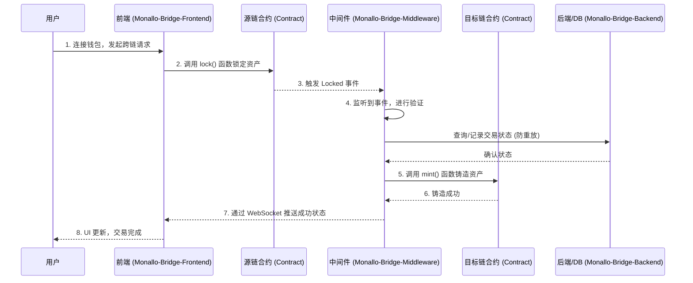

# Monallo

## 1. 项目简介

核心洞察： Monallo 项目是一个以 区块链跨链桥 为核心的基础设施，旨在实现不同区块链网络之间的资产和数据互操作性。从 `Monallo-Bridge` 系列代码库（前端、后端、中间件、合约）的明确分工来看，其主要产品是一个功能完备的跨链解决方案。

战略延伸： 项目的组织名称 `MonalloAI` 以及 `Monallo-Classroom` 仓库的内容表明，该项目拥有更宏大的战略愿景：将人工智能（AI）与 Web3 技术深度融合。跨链桥很可能是为其更广泛的去中心化 AI 生态（如其提到的 “Allora Network”）提供基础支持的关键组件，用于实现跨链 AI 代理的资产或信息交互。

因此，我们可以将 Monallo 理解为一个双层项目：
1.  当前核心： 一个实用的多链资产桥梁。
2.  未来愿景： 一个服务于去中心化 AI 的底层基础设施。

---

## 2. 组件分析

### `Monallo-Bridge-Frontend`

-   目的与功能:
    该组件是 Monallo 跨链桥的用户界面（UI）。用户通过这个界面与跨链桥进行交互，执行资产转移。其核心功能包括：
    -   钱包连接: 支持连接 MetaMask 和 OKX 等主流加密钱包。
    -   跨链交易: 用户选择源链、目标链和代币，发起资产转移。
    -   交易历史: 提供查询和展示用户跨链交易历史记录的功能。
    -   实时状态更新: 从提交信息来看，项目集成了 WebSocket，用于向用户实时推送交易状态更新（如铸币成功）。
    -   输入验证: 包含基础的业务逻辑，例如限制转出和转入网络不能为同一个。

-   技术栈:

| 类型 | 技术/框架 |
|:-|:-|
|语言| TypeScript|
|框架|Next.js|
|样式|PostCSS|
|包管理|npm|

-   关键信息:
    -   项目状态: 活跃开发中，有多个功能性提交记录。
    -   许可证: MIT License。

### `Monallo-Bridge-Backend`

-   目的与功能:
    该组件是跨链桥的服务器后端。虽然 README 信息较少，但其在架构中的角色通常是处理来自前端的 API 请求、管理业务逻辑和与数据库进行交互。它可能是连接前端请求与中间件处理的桥梁。

-   技术栈:

| 类型 | 技术/框架 |
| :--- | :--- |
| 语言 | TypeScript |
| 运行环境 | Node.js  |
| 包管理 | npm |

-   关键信息:
    -   项目状态: 已建立基础结构，但公开信息较少。
    -   许可证: MIT License。

### `Monallo-Bridge-Contract`

-   目的与功能:
    这是项目的链上核心组件，包含了部署在各个区块链上的智能合约。这些合约负责执行跨链操作中最关键的安全环节：资产的锁定、铸造、释放和销毁。
    -   多链兼容性: “About” 部分提到了 `Solidity`, `Func`, `WASM`, `Move`，这表明该项目有支持多种区块链生态的野心（例如，Solidity 用于 EVM 兼容链，Move 用于 Aptos/Sui 等）。
    -   开发环境: `hardhat.config.js` 文件的存在表明项目当前使用 Hardhat 框架进行 EVM 兼容合约的开发和测试。

-   技术栈:

| 类型 | 技术/框架 |
| :--- | :--- |
| 智能合约语言 | Solidity|
| 脚本/测试语言 | JavaScript|
| 开发框架 | Hardhat |

-   关键信息:
    -   项目状态: 活跃开发中。
    -   许可证: MIT License。

### `Monallo-Bridge-Middleware`

-   目的与功能:
    这是连接 链上事件 和 链下服务 的关键“胶水层”，是跨链流程自动化的执行者。其描述为“监听链上数据和接口工作，将资产从链A转移到链B”。
    -   事件监听: 核心功能是监听源链上智能合约的 `lock` (锁定) 事件。
    -   交易处理: 在监听到事件后，它会验证交易，检查数据库状态（例如确保交易未被处理过），然后触发目标链上的操作。
    -   资产铸造: 在验证通过后，它会调用目标链上的智能合约执行 `mint` (铸造) 操作，为用户生成跨链资产。
    -   前端通信: 集成了 WebSocket 服务，以便在铸币成功后能立即通知前端，提升用户体验。

-   技术栈:

| 类型 | 技术/框架 |
| :--- | :--- |
| 语言 | TypeScript  |
| 运行环境 | Node.js |
| 包管理 | npm |

-   关键信息:
    -   项目状态: 核心逻辑已在开发和迭代中。
    -   配置: 包含合约的 ABI（应用程序二进制接口）和地址信息，以与链上组件交互。
    -   许可证: MIT License。

### `Monallo-Docs`

-   目的与功能:
    该仓库是 Monallo 项目的官方文档中心，为开发者、用户和潜在合作伙伴提供概念、架构和技术细节的说明。它不仅解释了项目本身，还对“跨链桥”这一通用概念进行了科普。
    -   内容: 包含对跨链桥工作原理（锁定、打包、使用、赎回）的详细解释、不同类型的桥（锁定与铸造、销毁与释放等）的介绍，以及项目特定的设计文档，如数据库 ER 图 (`erdatabase.png`) 和流程图 (`流程图.png`)。
    -   战略作用: 是项目透明度和专业性的体现，有助于建立社区信任和吸引开发者。

-   关键信息:
    -   明确证实了 Monallo Bridge 是一个采用“锁定与铸造”模式的跨链桥。
    -   提供了宝贵的项目架构信息。

### `Monallo-Classroom`

-   目的与功能:
    这是一个教育性质的仓库，旨在降低机器学习和 Web3 的入门门槛，并为 Monallo 的生态系统培养潜在的开发者和用户。
    -   课程内容: 涵盖机器学习基础、数据处理、使用 Scikit-learn 构建模型，并引向对“Allora Network”（一个 AI 代理基础设施）的介绍。
    -   生态建设: 这是项目超越单纯工具、向平台和生态发展的战略性举措。通过教育，MonalloAI 试图围绕其技术（特别是其在去中心化 AI 领域的愿景）建立一个活跃的社区。

-   技术栈 (教学内容):
    -   Python
    -   Scikit-learn
    -   Pandas & Matplotlib
    -   Allora SDK (未来计划)

-   关键信息:
    -   明确了 Monallo 项目与去中心化 AI 的关联。
    -   是项目进行社区建设和生态布局的重要渠道。

---

## 3. 相互关系与整体架构

Monallo 的架构围绕行业成熟的 锁定-铸造 (Lock-and-Mint) 模式构建。整个流程由链上智能合约与链下服务协同驱动，确保了自动化和实时性。

架构交互流程图

工作流程详解

1.  发起交易: 用户通过 `Monallo-Bridge-Frontend` 连接钱包（如 MetaMask），选择源链、目标链及资产，授权并调用源链上 `Monallo-Bridge-Contract` 的 `lock` 函数。
2.  资产锁定: 源链合约锁定用户资产，并广播一个包含交易详情（如发送方、接收方、金额）的 `Locked` 事件。
3.  事件监听与验证: `Monallo-Bridge-Middleware` 服务作为核心“监听者”，捕获到 `Locked` 事件后，会：
    *   链上确认: 等待足够的区块确认数，确保交易的最终性。
    *   状态核实: 与 `Monallo-Bridge-Backend` 通信，查询数据库以防止重复处理（防重放攻击）。
4.  资产铸造: 验证通过后，中间件使用其受信任的地址调用目标链上 `Monallo-Bridge-Contract` 的 `mint` 函数，为用户的目标链地址铸造等值的封装资产（wrapped asset）。
5.  实时通知: 资产铸造成功后，中间件立即通过 WebSocket 连接向前端推送成功消息，实现低延迟的状态更新。
6.  更新界面: 前端接收到消息后，实时更新 UI，向用户确认交易完成，并刷新其资产余额。
辅助组件的角色:

-   `Monallo-Docs` (蓝图与指南): 它为整个架构提供了理论基础和技术蓝图。开发者可以依据此文档理解系统设计、进行集成或贡献。用户则能通过它理解项目的安全性和工作原理。
-   `Monallo-Classroom` (生态与愿景): 它在当前架构之外，扮演着更为长远的角色。通过普及 AI+Web3 知识，它为 Monallo 的最终愿景——一个去中心化的 AI 网络——铺平了道路。这个跨链桥，正是实现该网络中不同链上 AI 代理之间价值和信息流动的底层高速公路。
### Monallo 项目综合分析报告

核心洞察与战略评估

Monallo 项目展现了一个清晰的双层战略结构。其核心是一个基于 锁定-铸造（Lock-and-Mint） 模型的 区块链跨链桥，旨在提供安全、高效的多链资产互操作性。然而，其更深远的愿景是通过 `MonalloAI` 的品牌定位和 `Monallo-Classroom` 的教育布局，构建一个 服务于去中心化人工智能（AI）的底层基础设施。

> 本质上，当前的跨链桥不仅是一个独立的产品，更是为未来更宏大的去中心化 AI 网络（如其提到的 "Allora Network"）铺设的价值流转高速公路。

---

### 生态与战略布局

除了核心的跨链桥产品，Monallo 通过另外两个仓库，清晰地展示了其超越工具、构建生态的战略意图。

1. `Monallo-Docs`：知识与信任的基石
- 目的: 提供透明、详尽的技术文档，建立开发者和用户的信任。
- 价值:
  - 降低门槛: 详细解释了跨链桥的工作原理、类型（锁定与铸造 vs. 销毁与释放），为社区贡献者提供清晰指引。
  - 架构蓝图: 包含关键的数据库 ER 图和业务流程图，是理解系统内部设计的宝贵资料。
  - 专业体现: 完善的文档是项目成熟度和专业性的直接体现，有助于吸引合作伙伴和开发者。

2. `Monallo-Classroom`：未来生态的播种机
- 目的: 围绕 `AI + Web3` 主题进行社区教育，为最终的去中心化 AI 网络培养人才和早期用户。
- 战略意义:
  - 生态建设: 这是项目从工具向平台和生态演进的关键一步。通过教育，MonalloAI 正在围绕其长期愿景建立一个有粘性的社区。
  - 愿景关联: 课程内容从机器学习基础（Python, Scikit-learn）最终引向 "Allora Network"，明确了跨链桥与去中心化 AI 之间的内在联系。
  - 人才储备: 为未来的 Allora SDK 和相关生态应用培养潜在的开发者。

结论

Monallo 是一个设计精良、目标远大的项目。它不仅构建了一个功能清晰、架构合理的跨链桥，更重要的是，它将此桥梁定位为其未来去中心化 AI 网络的战略性基础设施。这种 “产品为基石，生态为远方” 的双轨并行策略，使其在众多 Web3 项目中脱颖而出，具备长期的发展潜力和想象空间。