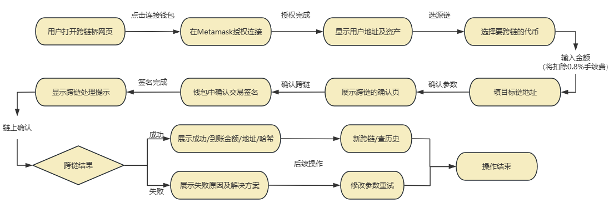

# Monallo Bridge
## 一、产品概述
跨链桥（Cross-Chain Bridge）是一种实现多个区块链生态之间资产和数据互通的基础设施。当前，区块链世界呈现出多链并存的格局，不同链之间的资产与协议孤立发展，造成了用户流动性分散、资产无法跨链使用等问题。
本产品旨在打通不同链之间的资产壁垒，使如以太坊（A 链）上的资产能够安全、高效地在 B 链上使用。跨链桥本质上是一个可信中继系统，依托链下或链上验证机制，将 A 链的状态变更以信息形式转化为 B 链上的资产表现。
## 二、核心定位与目标
##### 核心定位
* 资产互通：实现A链和B链之间资产的桥接，将打通封闭生态，提升资产的流动性；
* 产品收入：每笔跨链转账将扣除0.8%手续费，形成可持续稳定的收益；
* 生态协作：可为多种应用场景提供底层跨链能力，扩大生态范围。
##### 产品目标
* 打通多链资产流通通道；
* 提供安全高效的跨链传输体验；
* 为协议方和平台方创造长期稳定的收益来源；
* 降低用户跨链门槛，提高整体资产流动性。

## 三、功能架构
##### 跨链桥系统由以下四大核心模块组成：
|模块|功能说明|
|:-|:-|
|锁仓模块|在源链（如 A 链）上锁定用户资产，记录锁仓事件|
|验证模块|验证链上事件的真实性，支持轻客户端、共识节点或中继验证机制|
|铸造模块|在目标链（如 B 链）上铸造映射资产，代表用户在源链上的资产|
|回流模块|当用户销毁映射资产后，触发源链解锁原资产，实现跨链回流|
## 四、产品运行机制
各区块链现状：A链和B链各自运行，数据结构、共识机制不一，资产不相通。
##### Monallo Bridge工作原理：
- 锁定与铸造：用户在 A 链上将资产锁定，系统生成相应信息证明；
- 验证与映射：跨链桥组件验证该信息，确认后在 B 链上铸造对应数量的映射资产；
- 回流机制：当用户在 B 链销毁映射资产时，原资产可在 A 链解锁并提取。

----------------------------------

图 1 - 跨链流程

##### 跨链流程详解
###### 1. A 链 → B 链（资产转入，收取手续费）
- 用户将资产发送至 A 链上的桥接合约；
- 系统收取 0.8% 手续费并记录事件；
- 验证模块确认交易后；
- 在 B 链上铸造等值映射资产，用户获得跨链资产使用权。
###### 2. B 链 → A 链（资产回流，不收手续费）
- 用户在 B 链发起销毁操作；
- 验证模块确认映射资产被销毁；
- 源链（A 链）上的桥接合约解锁原生资产；
- 用户收到原始资产，全程**无额外费用**。

**流程简图**
``用户 → A 链锁仓 → 验证 → B 链铸造资产``
``用户 ← A 链解锁 ← 验证 ← B 链销毁资产``
>本产品支持资产进桥收取手续费，**出桥免费**，提升用户体验，降低资金回撤成本。
## 五、产品优势
- 高安全性：采用去中心化验证机制。
- 体验友好性: 回流免费，操作简单，一键跨链，降低用户操作成本
- 高扩展性：支持多主流链接入，模块化架构，便于迭代升级。
- 收益模式清晰：手续费收入与业务量直接挂钩，具备可持续盈利性。
- 易集成性：提供API，方便其他协议和应用集成桥接服务。